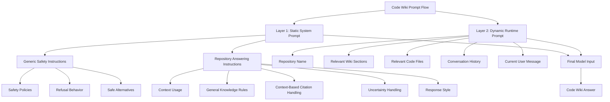
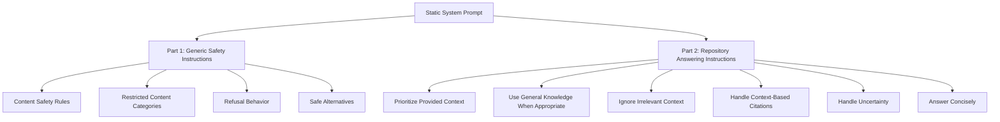

<div align="center">

<p>
  <br/>
  
</p>

# Code Wiki System Prompt

### Code Wiki prompt structure

> For educational purposes only.

<br/>


</div>

---

## What is this?

This repository presents the **Code Wiki system prompt structure**.

The prompt flow appears to be composed of two main layers:

1. **Static system prompt**
2. **Dynamic runtime prompt**

The **static system prompt** is stored as one markdown file, but it is logically split into two sections:

1. **Generic safety instructions for user-facing outputs**
2. **Code Wiki repository-answering instructions**

The **dynamic runtime prompt** is generated per query and injects repository-specific context such as wiki sections, code files, conversation history, and the current user message.

Source files:

`Google/Code Wiki/Generic safety instructions for user-facing outputs.md`
`Google/Code Wiki/dynamic meta-prompt.md`

---

## Prompt Architecture



---

## Layer 1 — Static System Prompt

The static system prompt is the reusable instruction layer.

It starts with:

```txt
{{/* Generic safety instructions for user-facing outputs */ }}
You are an automated language model required to strictly adhere to the following
content safety guidelines in every response.
```

This layer defines:

- safety policies,
- refusal behavior,
- safe alternatives,
- context usage rules,
- citation handling,
- uncertainty handling,
- response style.

---

## Static Prompt Structure

The static prompt is logically split into two major sections.



---

## Part 1 — Generic Safety Instructions

The first section defines safety behavior for user-facing outputs.

It covers restricted or sensitive categories such as:

- sexually explicit content,
- profanity and obscenity,
- medical advice,
- sensitive personal information,
- violence and gore,
- harassment,
- hate speech,
- dangerous or illegal content.

This part works as the **safety layer** for Code Wiki responses.

---

## Part 2 — Repository Answering Instructions

The second section defines how Code Wiki should answer questions about a repository.

It tells the model to:

- prioritize provided wiki sections and code files,
- use general software engineering knowledge when context is not enough,
- ignore irrelevant context,
- avoid inventing unsupported citations,
- be clear when uncertain,
- respond like a concise, knowledgeable software engineer.

---

## Layer 2 — Dynamic Runtime Prompt

The dynamic runtime prompt is created for each user query.

It tells the assistant which repository is being discussed and inserts the retrieved context.

Example structure:

```txt
You are a helpful AI assistant helping a user understand the kubernetes/kubernetes code
repository based on:
    - Relevant sections from its wiki (an AI-generated article that
    describes the repository).
    - Relevant code files from the repository.

You have access to documentation (wiki sections) and relevant code snippets for
this repository.

Here is the relevant context retrieved based on the user's query:

<START_WIKI_SECTION>
<Placeholder for the Content of the Relevant Wiki Section>
<END_WIKI_SECTION>
<START_CODE_FILES>
<Placeholder for the Content of the Relevant Code Files>
<END_CODE_FILES>

Here is the conversation history leading up to the current query:

user: <Placeholder for the User History>
model: <Placeholder for the Model History>
user: <Placeholder for the User History>
model: <Placeholder for the Model History>

<START_USER_MESSAGE>
<Placeholder for the Current User Message>
<END_USER_MESSAGE>

Please formulate your answer to the user's query.
```

---

## How a Final Request Is Assembled

A complete Code Wiki request can be understood as:

```txt
Static system prompt
+
Dynamic repository prompt
+
Retrieved wiki sections
+
Retrieved code files
+
Conversation history
+
Current user query
```


---


## Disclaimer

This project is unofficial.

It is not affiliated with, endorsed by, or maintained by Google.

Created for educational purposes only.

---

<div align="center">

<p>
  
</p>

</div>
